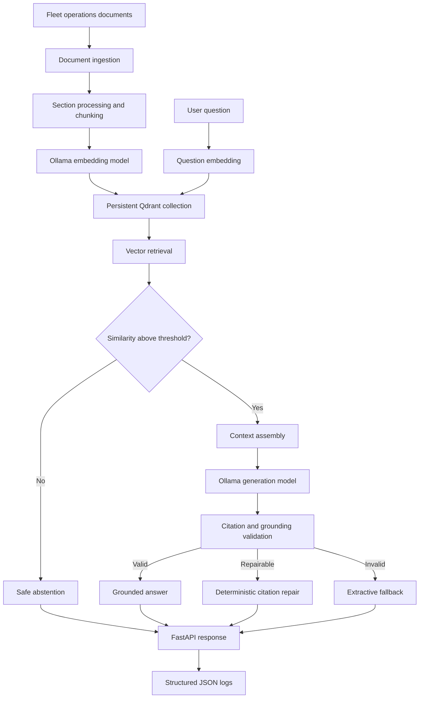

# Generative AI and LLM Engineering Learning Lab


[](https://github.com/mazyartaghavi/generative-ai-learning/actions/workflows/ci.yml)

A practical, incremental learning repository covering local large language models, structured generation, embeddings, retrieval-augmented generation, vector databases, FastAPI services, automated testing, observability, Docker, and continuous integration.

## Project status

The repository currently implements an end-to-end guarded RAG application for fleet-operations knowledge.

The application can:

- Run local language and embedding models through Ollama.
- Ingest and divide documents into retrievable chunks.
- Generate and persist vector embeddings.
- Store and retrieve vectors with local Qdrant.
- Apply a calibrated retrieval-confidence threshold.
- Answer supported questions using grounded evidence.
- Attach source citations to generated answers.
- Repair invalid citations deterministically.
- Fall back to extractive answers when generation validation fails.
- Abstain when the supplied sources are insufficient.
- Expose the application through FastAPI.
- Preserve request IDs across API responses and structured logs.
- Run as a Linux container through Docker Compose.
- Verify core behavior through an automated test suite.
- Build and test automatically with GitHub Actions.

## Architecture



## Main technologies

- Python 3.13
- `uv` for dependency and environment management
- Ollama
- `llama3.2:3b`
- `embeddinggemma`
- Qdrant local mode
- FastAPI
- Pydantic
- pytest
- Docker Desktop and Docker Compose
- GitHub Actions

## Repository structure

```text
.
├── .github/
│   └── workflows/
│       └── ci.yml
├── data/
│   ├── fleet_operations_manual.txt
│   ├── processed_fleet_sections.json
│   ├── fleet_chunks.json
│   └── fleet_vector_index.json
├── lessons/
├── scripts/
├── tests/
├── .dockerignore
├── .env.example
├── .gitattributes
├── .gitignore
├── compose.yaml
├── Dockerfile
├── pyproject.toml
└── uv.lock
```

The numbered lesson files show the incremental development path from introductory Python and API concepts to the complete guarded-RAG service.

## Prerequisites

Install:

1. Python 3.13
2. `uv`
3. Ollama
4. Docker Desktop with the WSL 2 Linux backend

Pull the required Ollama models:

```powershell
ollama pull llama3.2:3b
ollama pull embeddinggemma
```

Verify them:

```powershell
ollama list
```

## Local environment setup

Clone the repository and enter it:

```powershell
git clone https://github.com/mazyartaghavi/generative-ai-learning.git
cd generative-ai-learning
```

Create and synchronize the environment:

```powershell
uv sync --locked
```

Activate the Windows virtual environment:

```powershell
Set-ExecutionPolicy `
    -Scope Process `
    -ExecutionPolicy RemoteSigned

& .\.venv\Scripts\Activate.ps1
```

Copy the example configuration when local overrides are needed:

```powershell
Copy-Item .env.example .env
```

A real `.env` file is ignored by Git and must not contain credentials intended for publication.

## Run the API locally

Make sure Ollama is running, then execute:

```powershell
uv run python `
    -m lessons.lesson_54_observable_fastapi_app
```

Open the interactive FastAPI documentation:

```text
http://127.0.0.1:8000/docs
```

Check application health:

```powershell
Invoke-RestMethod `
    -Uri "http://127.0.0.1:8000/health"
```

## Run the automated tests

```powershell
uv run python -m pytest -q
```

Compile the Python sources:

```powershell
uv run python -m compileall `
    lessons tests scripts `
    -q
```

Validate the GitHub Actions workflow:

```powershell
uv run python `
    scripts/lesson_57_validate_ci_workflow.py
```

## Run with Docker Compose

Keep Ollama running on Windows.

Build the application image:

```powershell
docker compose build
```

Start the container:

```powershell
docker compose up -d
```

Check its status:

```powershell
docker compose ps
```

Run the end-to-end container smoke test:

```powershell
uv run python `
    scripts/lesson_56_container_smoke_test.py
```

Inspect structured application logs:

```powershell
docker compose logs api
```

Stop and remove the container and project network:

```powershell
docker compose down
```

The local Qdrant files under `data/qdrant_local` are mounted into the container but excluded from Git.

## Reliability and safety behavior

The guarded-RAG runtime uses several safeguards:

- Retrieval confidence is checked before generation.
- Unsupported questions return an explicit abstention.
- Generation is skipped when retrieval evidence is insufficient.
- Generated citations are validated against supplied sources.
- Invalid citations can be repaired deterministically.
- Extractive fallback prevents unsupported generated answers.
- Model clients are shared through the application runtime.
- API requests carry correlation IDs.
- Structured JSON logs record request outcome and duration.

## Continuous integration

The workflow under `.github/workflows/ci.yml` runs on:

- pushes to `main`
- pull requests
- manual workflow dispatches

It performs:

1. Python 3.13 environment setup
2. locked dependency installation
3. lock-file validation
4. source compilation
5. the complete pytest suite
6. a production Docker image build

The live Ollama smoke test remains a local integration test because GitHub-hosted runners do not contain the locally installed Ollama models.

## Learning progression

The repository develops incrementally through:

1. Python and API fundamentals
2. Prompt design and evaluation
3. JSON and Pydantic structured output
4. FastAPI and client testing
5. Embeddings and similarity
6. Tokens, attention, and transformer foundations
7. Document ingestion and chunking
8. Vector indexing and retrieval
9. Grounded RAG and citation validation
10. Retrieval robustness and safe abstention
11. Persistent Qdrant storage
12. Component interfaces and dependency injection
13. Runtime configuration
14. Shared Ollama clients
15. FastAPI lifecycle management
16. Structured observability
17. Docker containerization
18. GitHub Actions continuous integration

## Purpose

This is an educational engineering repository. It documents the development process and demonstrates the technical foundations later used in a cleaner recruiter-facing FleetMind RAG application.
